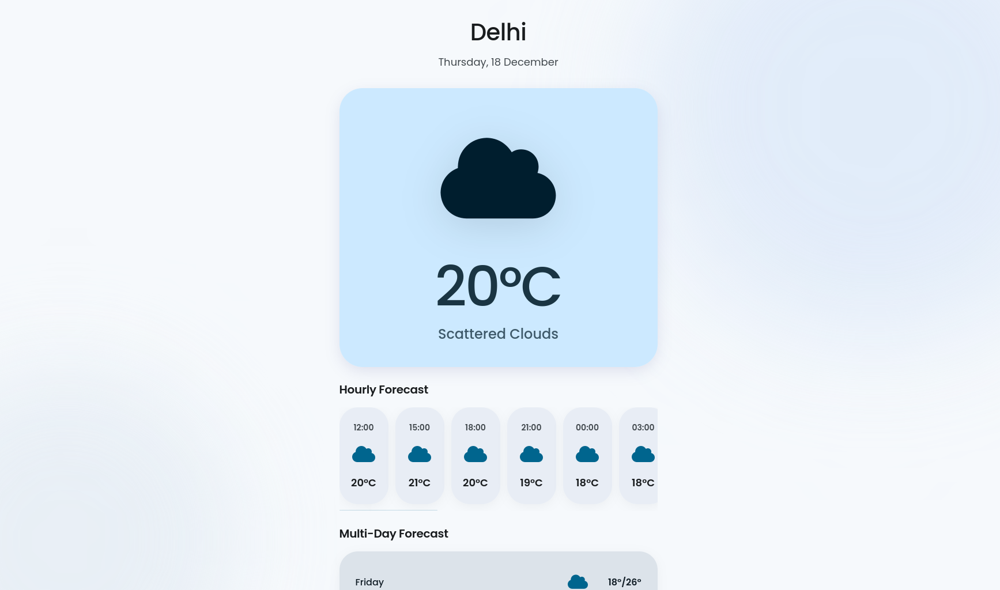

# 🌦️ Weather App

A modern weather forecasting web app built with **React + TypeScript**, providing real-time weather data, hourly forecasts, and multi-day forecasts with a clean UI.

🔗 **Live Demo:**
👉 [https://auysh8.github.io/weather-app/](https://auysh8.github.io/weather-app/)

---

## ✨ Features

* 🌍 Search weather by city
* 📍 Automatic location detection (via browser geolocation)
* 🕒 Hourly forecast
* 📆 Multi-day forecast
* ⭐ Bookmark cities (saved in localStorage)
* 🎞️ Smooth animations using Framer Motion
* ⚡ Fast builds with Vite
* 🧭 GitHub Pages deployment

---

## 🛠️ Tech Stack

* **Frontend:** React, TypeScript
* **Build Tool:** Vite
* **Routing:** React Router (HashRouter for GitHub Pages)
* **Animations:** Framer Motion
* **API:** OpenWeatherMap API
* **Hosting:** GitHub Pages

---

## 🚀 Getting Started (Local Setup)

### 1️⃣ Clone the repository

```bash
git clone https://github.com/auysh8/weather-app.git
cd weather-app
```

### 2️⃣ Install dependencies

```bash
npm install
```

### 3️⃣ Add environment variables

Create a `.env` file in the root directory:

```env
VITE_OPENWEATHER_API_KEY=your_api_key_here
```

You can get a free API key from:
[https://openweathermap.org/api](https://openweathermap.org/api)

### 4️⃣ Run the development server

```bash
npm run dev
```

The app will be available at:

```
http://localhost:5173
```

---

## 🌐 Deployment (GitHub Pages)

This project is deployed using the **gh-pages** branch.

### Build & Deploy

```bash
npm run deploy
```

Make sure:

* `vite.config.ts` contains:

  ```ts
  base: "/weather-app/"
  ```
* GitHub Pages settings are:

  * **Branch:** `gh-pages`
  * **Folder:** `/ (root)`

---

## 📸 Screenshots (optional)




---

## 📚 What I Learned

* Proper TypeScript typing for API responses
* Handling `never` and `unknown` safely
* Client-side routing on static hosting
* GitHub Pages deployment workflow
* Structuring a real-world React project

---

## 📄 License

This project is open source and available under the **MIT License**.
